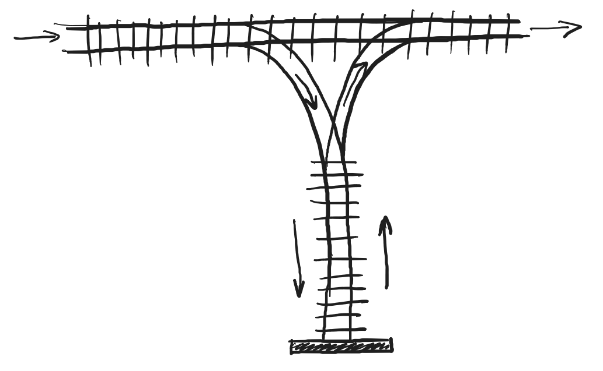

# Mensa gymnázium, o.p.s. - Maturitní zkouška z Informatiky 2025 - Zadání

## Pokyny
Níže najdete zadání čtyř úloh. Libovolné tři z nich naprogramujte ve vhodném programovacím jazyce, jednu můžete vynechat, nebo využít pro získání bonusových bodů. Na práci máte 240 minut, po přestávce pak 15 minut na obhajobu před komisí.

Komunikovat smíte pouze se zkoušejícím(i), ale jinak můžete používat internet (včetně AI), literaturu, knihovny, tutoriály, dokumentace, svoje vlastní poznámky, svůj vlastní kód apod.

Pište přehledný, komentovaný, čitelný kód. Nebojte se ptát zkoušejících, v nejhorším vám neodpovíme, nebo popostrčíme kupředu za cenu bodové ztráty.

Není-li předepsaný formát vstupu/výstupu, zvolte vhodnou reprezentaci dle vlastního uvážení, která vám umožní předvést funkčnost algoritmu při obhajobě (stdin-out, konzolová aplikace, GUI, ...).

### Odevzdání a obhajoba
Založte si privátní GitHub repozitář(e), do kterého **průběžně pushujte** postup své práce. Do repozitáře [**nastavte přístup (collaborator)**](https://docs.github.com/en/account-and-profile/setting-up-and-managing-your-github-user-account/managing-access-to-your-personal-repositories/inviting-collaborators-to-a-personal-repository) pro následující GitHub účty:
* `hakenr`
* TODO 

Při závěrečné obhajobě (15 min) bude vaším úkolem představit řešení a funkčnost jednotlivých úloh:
* vysvětlit stručně postup algoritmu,
* ukázat a popsat zdrojový kód (lze spojit s vysvětlováním algoritmu),
* předvést spustitelný a funkční program (musí být možné předat vstupy a ověřit výstupy)

Pamatujte na omezený čas obhajoby, na každou úlohu je max. 5 minut.

### Hodnocení
Za každou úlohu můžete získat 0-30 bodů, dalších 0-10 bodů pak můžete získat u obhajoby.
Výsledné hodnocení se určí takto:
* 86 a více bodů - výborné,
* 68 až 85 bodů - chvalitebné,
* 50 až 67 bodů - dobré,
* 33 až 49 bodů - dostatečné,
* 32 a méně bodů - nedostatečné - neuspěl(a)

## Úloha 1 -  Generátor kalendáře
Vytvořte program, který na základě vstupu (měsíc a rok) vygeneruje přehledný měsíční kalendář ve formátu ASCII-art. Kalendář musí správně zohlednit přestupné roky a začátek týdne (pondělí).

Příklad vstupu:
```
2024 5
```
Příklad výstupu:
```
Květen 2024
Po Út St Čt Pá So Ne
       1  2  3  4  5
 6  7  8  9 10 11 12
13 14 15 16 17 18 19
20 21 22 23 24 25 26
27 28 29 30 31
```

## Úloha 2 - Řazení vagónů
Vytvořte program, který simuluje řazení vagónů na železničním nádraží. Vlak přijíždí na železniční stanici po hlavní koleji s vagóny očíslovanými od 1 do N v zadaném pořadí. Vaším úkolem je určit, zda lze tyto vagóny seřadit do vzestupného pořadí (od nejmenšího po největší číslo), a to za následujících pravidel:
* skrze nádraží je hlavní kolej, po které vlak do stanice přijíždí a také z ní odjíždí,
* vlak je možné v kterémkoliv místě rozpojit nebo spojit,
* ve stanici lze T-výhybkou odbočit na kolmou vedlejší slepou kolej (s neomezenou kapacitou),
* zpět z vedlejší koleje lze couvat na hlavní kolej, vagóny pokračují v pořadí, v jakém opouští vedlejší kolej,
* na hlavní koleji se nesmí couvat, nelze stát v prostoru výhybky.


Příklad vstupu a výstupu:
```
4 1 3 2 5
ANO
```
1. `4` na vedlejší kolej
1. `1` projede po hlavní koleji
1. `3` na vedlejší kolej
1. `2` projede po hlavní koleji
1. `3` zpět z vedlejší na hlavní kolej
1. `4` zpět z vedlejší na hlavní kolej
1. `5` projede po hlavní koleji

## Úloha 3 - Palindromická čísla
Palindrom je číslo, které se čte stejně zleva doprava i zprava doleva. Napište program, který pro zadané kladné celé číslo najde nejbližší vyšší i nižší palindromické číslo.

Příklad vstupu a výstupu:
```
Vstup: 123
Nižší palindrom: 121
Vyšší palindrom: 131
```

## Úloha 4 - Počítání ostrovů

Mějme dvourozměrnou mapu složenou ze dvou typů buněk:

* `1` reprezentuje zem
* `0` reprezentuje vodu

Za ostrov považujeme souvislou oblast tvořenou zemí (`1`), přičemž dvě políčka země spolu sousedí, pokud se dotýkají horizontálně nebo vertikálně (nikoli diagonálně).

Vaším úkolem je napsat program, který spočítá, kolik jednotlivých ostrovů mapa obsahuje.

### Příklad

#### Vstup:

```
1 1 0 0 0
1 1 0 0 1
0 0 0 1 1
0 1 0 0 0
```

#### Výstup:

```
3
```